# Getting started with Micro Focus Enterprise Developer for Visual Studio 2022

## Overview

This set of tutorials guides you through the use of Micro Focus Enterprise Developer for Visual Studio 2022. They provide a basic understanding of how the product operates.

These tutorials are designed for developers who have experience with developing COBOL on the mainframe but do not necessarily have a working knowledge of the Visual Studio Integrated Development Environment (IDE). The tutorials provide a basic understanding of the features offered in Enterprise Developer for Visual Studio 2022 to develop and maintain both simple COBOL and mainframe subsystem applications.

Other tutorials, which are designed for Administrators, are available.

- [Starting the Visual Studio Integrated Development Environment](#starting-the-visual-studio-integrated-development-environment)
- [Adding files to your Visual Studio project](#adding-files-to-your-visual-studio-project)
- [File, Project and IDE properties and settings](#file-project-and-ide-properties-and-settings)
- [Editing COBOL, JCL, BMS, and Data Files](#editing-cobol-jcl-bms-and-data-files)
- [Compiling the source code](#compiling-the-source-code)
- [Unit Testing the Batch Application](#unit-testing-the-batch-application)
- [Unit Testing the Online Application](#unit-testing-the-online-application)
- [Debugging the Batch Application](#debugging-the-batch-application)
- [Debugging the Online Application](#debugging-the-online-application)

**Download the demonstration application**

A preconfigured, fully executing application, BankDemo, is available from the Micro Focus GitHub repository - [*click here*](https://github.com/MicroFocus/BankDemo). Download the sample's sources as follows:

1.  In the GitHub repository for the BankDemo demonstration, click **Releases** in the right-hand side part of the page.
2.  In the list of releases, locate and click the one that corresponds to the Enterprise Developer product release you have installed.
3.  Expand the **Assets** section, and click either **Source code (zip)** or **Source code (tar.gz)** to download the archive with the sample's sources.
4.  Expand the archive on your machine.

    The demonstration application includes all the source files needed to run it. The application is both a batch and online application which assesses data on a fictitious bank system. The bank data is stored in VSAM files.

     **Important:** Before attempting this tutorial, create a directory on your machine for the sample files - for example, create a MFETDUSER directory on the root of your local drive (C:). Copy the entire contents from the expanded folder into the newly created directory. For example, you should have a **c:\\MFETDUSER\\datafiles** folder, etc.

    As part of this tutorials, you use the supplied standard Visual Studio project for Mainframe Subsystem Applications to set up a development environment for this application. The tutorials show how you can:
    -   Edit the source files
    -   Compile the source code
    -   Execute and debug the application

    **Prerequisites**

    You must have the following software installed:

    -   Micro Focus Enterprise Developer for Visual Studio 2022. [*Click here*](https://www.microfocus.com/documentation/enterprise-developer/) to access the product Help and the release notes of Enterprise Developer.
    -   A TN3270 terminal emulator to run the CICS application. This tutorial uses Micro Focus Host Access for the Cloud (HACloud), which is installed with Enterprise Developer, but you may use an alternative terminal emulator. **Note:** A license for Micro Focus Rumba+ Desktop was included with Enterprise Developer product releases 8.0 and earlier, and can be used to run this tutorial.

**Using a remote enterprise server instance for the tutorials**

   If you have an active firewall on the machine that is running your Directory Server and enterprise server instances, and you want remote clients to be able to connect to them, you must ensure that the firewall allows access to the ports that you are using.
    
   For example, Directory Server is configured, by default, to use port 86. You must configure your firewall to allow TCP and UDP access to this port. Similarly, the enterprise server instance you create as part of this tutorial, BANKDEMO, has listeners which use ports 9003 and 9023. For remote clients to be able to submit JCL jobs or connect a TN3270 terminal to these listeners, your firewall must permit access to these ports.

   We recommend that, if you want remote users to access Enterprise Server functionality through the firewall, you use fixed port values so that you can control access via these.

## Starting the Visual Studio Integrated Development Environment

[Back to Top](#overview)

1. To start the Visual Studio IDE:

    **On Windows 10**: From your Windows desktop, click **Start \> Visual Studio 2022**.

    **On Windows 11**: Click the **Start** button in the Task Bar. Use the search field in the Start menu to find and start **Visual Studio 2022**.

    If this is the first time you have started Visual Studio on your machine, you are prompted to specify default environment settings. Set **Development Settings** to **General**.

2. You then see the Visual Studio start screen - click **Continue without code**:

    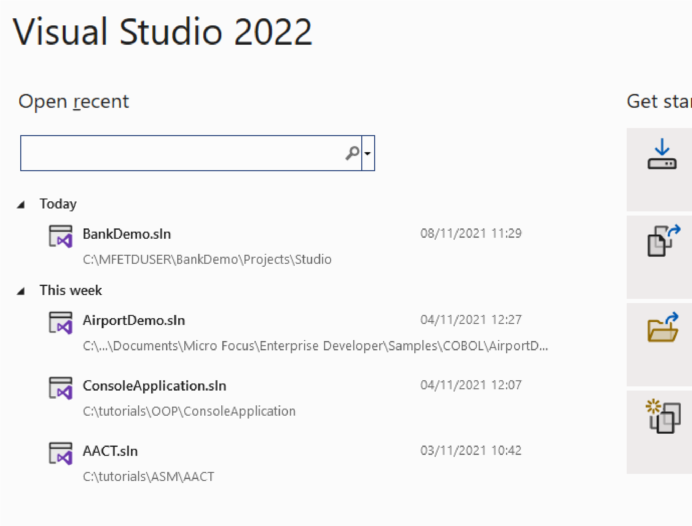
The windows you see open in Visual Studio and their layout depend on whether you have used the IDE before and on the edition of Visual Studio that you might have installed on your machine. You can move, resize and minimize windows which is why they may not look exactly like described here.
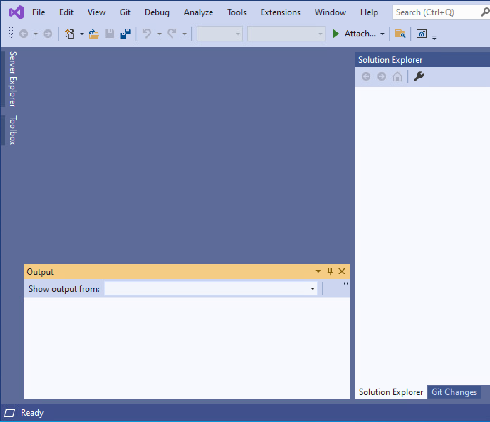

You can see:

-   The **Solution Explorer** window which gives a direct view of what is on disk for your solutions.

    A solution is a holding place for projects that relate to the solution. For example, the solution you are going to work with contains two projects - a batch project and an online project.

-   Bottom right is a **Properties** window which shows the properties of the currently selected item in the Solution Explorer when you have a project loaded in it. You can open the window from **View \> Properties**.
-   **Output** window - displays the results of tasks and from compiling your applications.
-   **Error List** window - displays details about any errors that might be present in the code.
-   Project Details window which gives a logical view of your COBOL application.
-   The main activity window at the top the IDE, the Editor, is where you edit or debug the sources. This window is currently empty.
-   Apart from the menus, there are a number of buttons in the toolbar, which vary depending on what you are currently doing with the IDE.

3. Experiment with resizing, minimizing and restoring the windows.

    To move a window:

    - Click the title bar of the window. Holding the mouse on the window title, drag the window to the left and down.

      **Note:** If you close a window, you can restore if from the **View** menu.

    - If you wish to restore the default windows layout of the IDE, click **Window** \> **Reset Window Layout**.

 **Open the Bankdemo solution**

1.  Click **File** \> **Open** \> **Project/Solution**.
2.  Navigate to the **C:\\MFETDUSER\\tutorial\\projects\\Studio\\cobol** folder, select **Bankdemo.sln**, and click **Open**.

    This opens the solution in the Solution Explorer window.

## Adding files to your Visual Studio project

[Back to Top](#overview)

The source files of the demonstration application are stored in subfolders named after the file type (for example, **bms**, **cobol**, **copybook**, **jcl**) in the **C:\\MFETDUSER\\sources** directory. The Visual Studio project is in the **C:\\MFETDUSER\\tutorial\\projects\\Studio\\cobol** folder. You will be adding the source files to the Visual Studio project. The other folders that are not so obvious are:

| **Folder Name**       | **Use**                                                                                                                                             |
|-----------------------|-----------------------------------------------------------------------------------------------------------------------------------------------------|
| system                | Contains some resource definition data for CICS – this has been exported from the Mainframe and converted into a suitable form for the workstation. |
| system\\catalog       | Stores the catalog.                                                                                                                                 |
| system\\catalog\\data | Stores the data files.                                                                                                                              |
| system\\logs          | Contain various log files indicating the progress of your application execution.                                                                    |
| system\\rdef          | Contains the resource definition files for the BANKDEMO Enterprise Server region.                                                                   |

**Configuring directives scanning**

By default, the IDE is configured to automatically scan any new source files you add to the project. It assesses the code, determines what Compiler directives are required and then, by default, offers to set those directives on the files. 

To check what directives will be set:

1.  In Visual Studio, click **Tools** \> **Options**.
2.  Scroll down to and expand **Micro Focus Tools**, expand **Directives**, and click **COBOL**.

    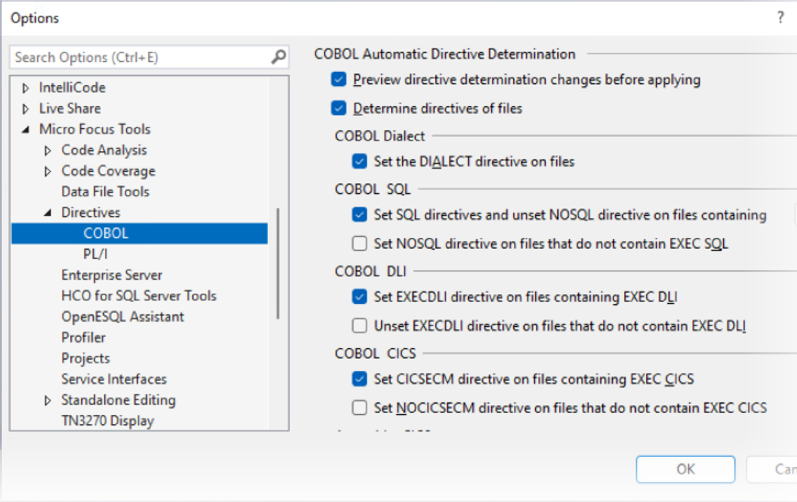This page enables you to configure what directives are set on the COBOL files that you add to your project. The directives scanning determines the dialect, what EXEC CICS and EXEC SQL statements are used in the COBOL source files and sets directives as detailed on this page.

3.  Ensure all options are selected.

    The **Preview directive determination changes before applying** options ensures that you can review and approve the directives that will be set on the files after a directives scan.

4.  Click **OK**.

**Adding COBOL source files**

To add the COBOL programs to your project:

1.  In Solution Explorer, right-click the **BankDemo** project and click **Add** \> **Existing Item**.
2.  Browse to **C:\\MFETDUSER\\sources\\cobol\\core**.

    By default, the file type filter is set to **Enterprise Files (\*.cbl; \*.cpp; \*.cob, ...)**. 

3. Select all **.cbl** files in this folder, and click **Add**.

    This adds all COBOL programs from the **core** subfolder.

    Previously, you ensured the IDE is configured to scan the COBOL files you add into the project and set directives for dialect, EXEC CICS and SQL. When the files are being imported in the project, the IDE scans them for CICS and SQL settings. You can see that the **Output** window shows some messages about scanning the files. At the end of scanning, the IDE shows a **Preview Changes Directive Determination** dialog box to set any missing directives as required. Review the directives, and click **Apply**.

   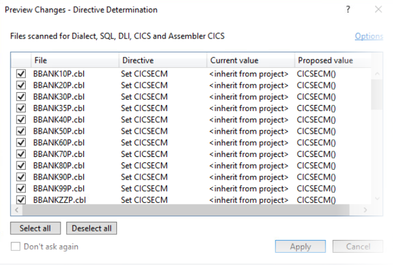

   **Note:** In most cases, you add the actual COBOL programs to your Visual Studio project. Optionally, you could have left the source files in the original location and could have created links to them. This might be useful if you have large source files. In such cases, you would have used the **Add As Link** command to add the files to your project:

   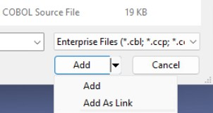

4.  Look in the **Output** window to see the result of the directives scan and what directives have been set on the files.

    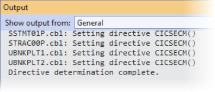

    If there are any issues such as the IDE not being able to determine the dialect because of missing copybooks, these are reported here.

5.  If, at any stage, you need to perform a directives scan of the COBOL sources in the project to set Compiler directives on them, right-click the **BankDemo** project, and click **Determine Directives**.

**Adding the copybook files**

The copybook files in the **C:\\MFETDUSER\\sources\\copybook** folder are used by the COBOL programs in the project. Your project is preconfigured to look for the copybook files in that location so the compilation will not fail. To see where this is set:

1.  Click **Project** \> **BankDemo Properties** to open the project properties.
2.  Click the **Dependency Paths** tab, and ensure **Type** is set to **COBOL Copybook Paths**. The folder that is listed on that page is the folder that includes the copybook files.

    The copybook files are not compiled when you build the application which is why it is not necessary to add them to the project. However, as an exercise, you can add one of the copybooks to the project in the same way you added the COBOL files.

**Adding BMS source files to your project**

You need to add the demonstration's BMS file to the project. To do this:

1.  In Solution Explorer, right-click the **BankDemo** project and click **Add** \> **Existing Item**.
2.  Browse to **C:\\MFETDUSER\\sources\\bms\\cobol** folder.
3.  The file extension filter should be set to **Enterprise Files** but, as an exercise, you can set it to **BMS Files (\*.bms)**.

    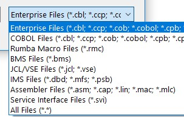

4.  Select all **.bms** files in the folder, and click **Add**.

    This adds the BMS files to the project.

**Adding JCL source files**

To add the JCL file to your project:

1.  In Solution Explorer, right-click the **BankDemo** project and click **Add** \> **Existing Item**.
2.  Browse to **C:\\MFETDUSER\\sources\\jcl** folder.
3.  Set the file type filter to **JCL/VSE Files (\*.jcl; \*.vse)**.
4.  Select **ZBNKSTMT.jcl**, and click **Add**.

    This adds the JCL file to the project.

**Adding data files**

The demonstration application includes a number of data files. To see how you can edit data files, you only need to look at one of these files so you do not need to add a folder for it to the project. To add the data file to your project:

1.  In Solution Explorer, right-click the **BankDemo** project and click **Add** \> **Existing Item**.
2.  Browse to **C:\\MFETDUSER\\datafiles**.
3.  Set the file type filter to **All Files (\*.\*)**.
4.  Select the **MFI01V.MFIDEMO.BNKACC.dat**, and **MFI01V.MFIDEMO.BNKACC.str** files, and then click **Add**.

**Viewing the project details**

The **Project Details** window shows a list of all files in your project or in the entire solution together, explore details such as the file type, location, COBOL dialect, number of errors or warnings and whether there are file directives that differ from and override the directives set on project level. This can help you identify problems quickly. To open the window:

1.  Right-click your solution (or the project) in Solution Explorer and click **Project Details**. 

    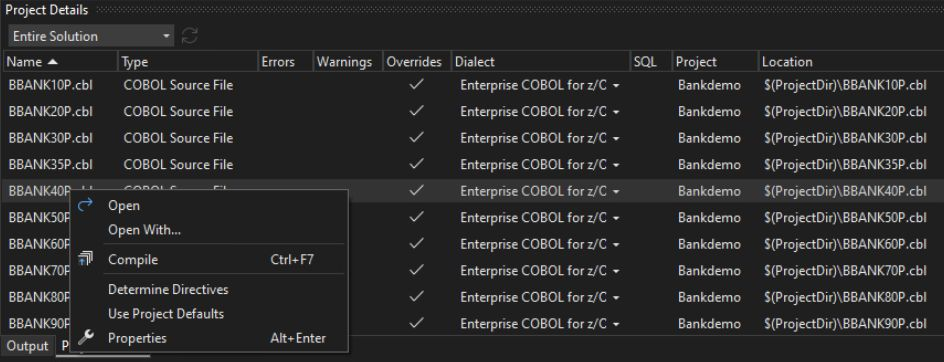

2.  Click either one of the columns to sort the list, clicking , **Sync with Active Document**, to enable the window to highlight the file which is opened in the editor or is selected in Solution Explorer.
3.  Right-click a COBOL program in the list to either compile it, access its properties or adjust its Compiler directives using either **Determine Directives** or **Use Project Defaults**.

**Grouping the files of the same type in Solution Explorer**

In Solution Explorer, you can view an actual representation of the files and folders in a project or toggling the Virtual View to sort the files by file type:

1.  In Solution Explorer, click **Bankdemo**.
2.  Click  in the Solution Explorer toolbar to toggle Virtual View on or off.

    In Virtual View, you see virtual folders in the project for the different file types - COBOL programs, BMS or JCL files:

    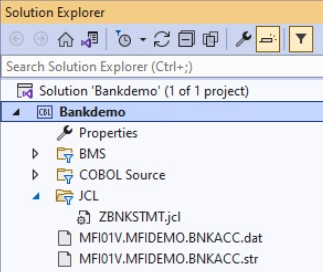

    Note that there is no folder for the copybooks as they are not added directly to the project in the IDE.

    **Viewing the copybook dependencies**

    Solution Explorer shows which copybooks are used by your source programs. To view the copybook dependencies of a COBOL program, simply expand the node for that program:

    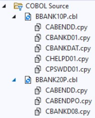

**Summary**

   You created a Visual Studio project, added the COBOL files, the BMS and the JCL files of the demonstration program as links to the project and added the path to the folder that contains the copybooks to the project's properties.

   Next, you are going to explore the settings available in the IDE and then you are going to edit some of the source files.

## File, Project and IDE Properties and Settings

[Back to Top](#overview)

There is a variety of options and settings that can be configured within Visual Studio. You are going to explore a few of them in this tutorial. Do not skip this section, as you are going to make at least one important configuration change in the project's properties.

**Exploring the IDE settings**

1.  In Visual Studio, click **Tools** \> **Options**.
2.  Expand **Projects and Solutions**, and click **Locations**.

    The **Projects location** field defines the default location for storing new projects. You can change this path if you are using a different working folder.

    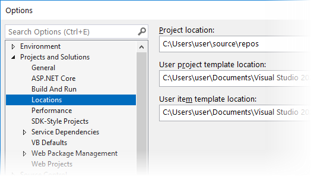

3.  In the **Options** dialog box, expand **Environment**, and click **Fonts and Colors**.
4.  Ensure **Show settings for** is set to **Text Editor**.
5.  Look in the list in the **Display Items** pane and note the COBOL, BMS, and JCL items whose font and color you can change.
6.  In the **Options** dialog box, expand **Text Editor**, and then expand **Micro Focus COBOL**.

    You can use the settings in this section to configure features of the editor such as tab size, COBOL margins, some syntax checking rules, and others.

    From the **Quick Actions** page for the editor properties, you can manage what quick actions will be enabled in the editor.

    From the **Advanced** page you can fine tune the behavior of some features of the editor such as background syntax checking and outlining. You can also disable features that are not necessary which could be useful if you are working with a large code base.

**Configuring the COBOL editor**

You can configure how the editor wraps the code around the margins, or how it indents the code in the different COBOL areas, or how the **Home** and **End** keys move the cursor in the different areas. You can also choose the style of the ruler, and change the colors of the text and the margins. You can change the default editor settings and experiment with the new behavior by opening one of the COBOL programs in the editor.

You can now experiment by changing the following settings:

-   Click **Tools \> Options \> Text Editor \> Micro Focus COBOL \> Margins** - modify the settings for the **Smart edit mode** which controls the word wrapping and the indentation in the different COBOL areas.

    When there is a COBOL file opened in the editor, you can use , **Toggle COBOL Smart Edit Mode**, in the COBOL toolbar to turn on or off the smart editing mode. To open the COBOL toolbar, click **View \> Toolbars \> COBOL**.

-   On the same page in the IDE options, change the behavior of the **Home** and **End** keys.
-   On the same page in the IDE options, check **Show the ruler** and check **Mainframe style**.

**Project Properties**

The properties you set at project level apply to all files in the project. Here's how to access them:

1.  Select the **Bankdemo** project in Solution Explorer, and click **Project** \> **Bankdemo Properties**.

    This opens the tabbed property pages for the project in the main Visual Studio window.

2.  Click the **Dependency Paths** tab.

    **Type** should be set to **COBOL Copybook Paths**. Note that this is already set to **..\\..\\..\\..\\..\\sources\\copybook** set. This is the folder in the sample where the IDE is going to look for the copybook files required by this project and is relative to the project file.

    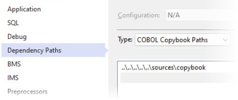

3.  Click the **BMS** tab.
4.  Note the following paths in the **Output** section:

    **.\\generated** in the **Copybook Output Path** field

    This is the path for the copybooks that will be produced from the BMS files during the build.

5.  Click the **COBOL** tab.
    -   Note that the **COBOL dialect** is set to **Enterprise COBOL for z/OS** for the entire project.
    -   Note that **Character set** is set to **ASCII**. You may need to scroll the **COBOL** property page to the right or expand the IDE to see the setting.
    -   Note that the **Output path** is set to **.\\bin\\x64\\Debug\\**. This is where the build will produce the application executables.
    -   See what other directives have been set in the **Additional Directives** field.
    -   **Build Settings** is a read-only field that shows all directives that are set on the project.

        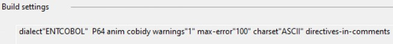

6.  As you have made changes to the project properties, click **File** \> **Save All** in order to keep them.

**File Properties**

The individual source files can have their own local properties which override the project settings. To check a file's properties:

1.  In Solution Explorer, right-click **BBANK10P.cbl**, and click **Properties**.

    This opens the COBOL-specific file properties.

    Notice that **CICS Directives** is set to **CICSECM()**. This has been set when you added the file to the project or performed a directives scan of the COBOL sources in your project.
    
    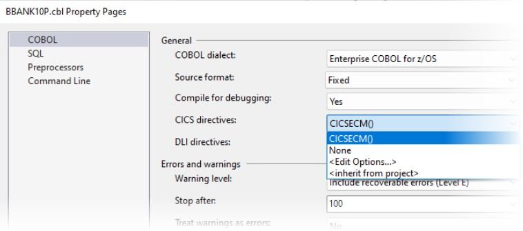

2.  In Solution Explorer, click the **MBANK10.bms** file in your project.
3.  Click the **View** main menu and then click **Properties Window**.

    This opens the Visual Studio properties window. Note that the **Build Action** is set to **BMS Compile** which means the build invokes the BMS Compiler.

    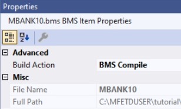

4.  Similarly, check the properties for the **.dat**, the **.jcl**, and the **.cpy** files and see that the **.dat** files and the copybooks will not be compiled.

## Editing COBOL, JCL, BMS, and Data Files

[Back to Top](#overview)

This topic describes the editing features for the various file types used in your project.

**Note:** We recommend that you create backup copies of all files before you start editing them.

**Editing COBOL Files**

You are going to explore some of the COBOL editing features using the **ZBNKPRT1.cbl** program which produces a report from a sequential data file.

1.  In Solution Explorer, double-click **ZBNKPRT1.cbl**.

    This opens the file in the COBOL editor in Visual Studio.

2.  To enable the line numbers in the editor, click **Tools \> Options \> Text Editor \> Micro Focus COBOL \> General**, and check **Line numbers**.

3. Click **OK**.            

**Expanded** **Copybook** **View**

 1. Scroll down the file to line 61 and see some COPY statements. 
 2. Right-click the line for COPY CDATED, and click **Show "CDATED.CPY"**. This expands the copybook directly in the code of **ZBNKPRT1.cbl**. 

    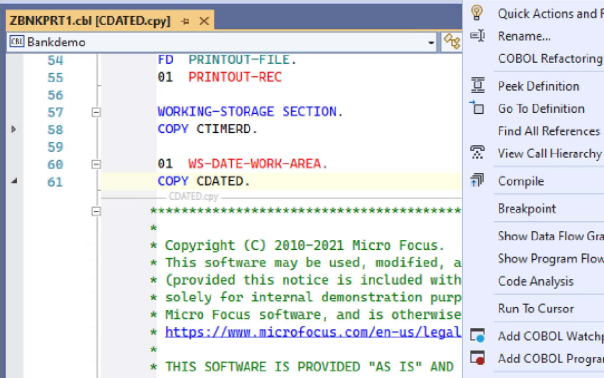

3. You can edit the code of the copybook in the expanded view so introduce an error in the code now.

    This automatically outputs messages in the **Error List** window about problems that occurred in the co name. You can sort the list by file name. Double-clicking the line for an error in the **Error List** window positions you on the line in the co which causes the error.

    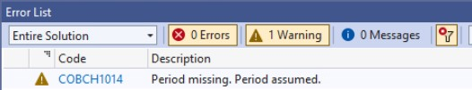

4. Right-click in the expanded copybook, and click **Hide "CDATED.CPY"**. 

5. Close the file. The changes you made to the expanded view were applied to the source of the copybook so now you click **No**.

**Unused data**

Notice that some data items in the Data Division are greyed out. This is because they are not referenced in the Procedure Division.                                                                                             
**Class View** 

You can view the objects and the members defined in your projects in the standard Class View located in right of the IDE:

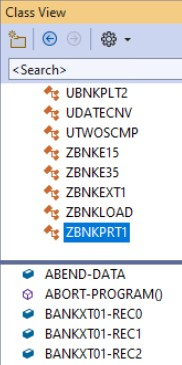

 If this window is closed, you can open it from **View** \> **Class View**.

**Navigation in the code** 

Apart from scrolling down the code in the editor, you can use the following features of the IDE:
  -   Use the drop-down menus at the top of the editor:

        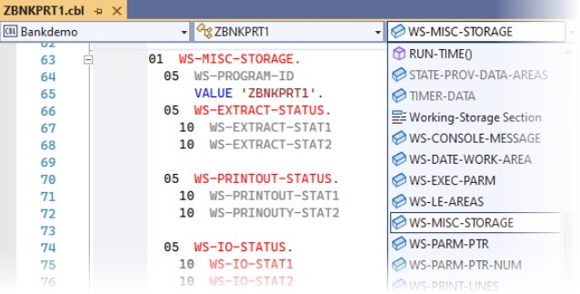

   -   In Solution Explorer double-click on **SBANK00P.cbl** to open the file, and then click on **Edit** \> **Go To** \> **Go To Line** to specify a line in the code to navigate to.
    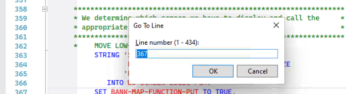
   
   -   Click , Locate Definition, in the COBOL toolbar and start typing a search term: 
   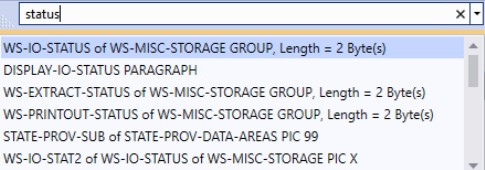

 **Exploring data in editing mode** 
 
 Open the ZBNKEXT1.cbl file, and scroll down the code to line 227. Hover over the WS-RECORD-COUNTER2 data item. This provides you with details of the location, the size, the format, and the number of times the field is used in the program. 

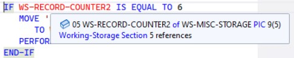

**Data definitions**
- Right-click a data item in the Procedure Division and click **Go To Definition**. This positions the cursor on the line of code where the data item is defined. 

**Peek** **definitions**

1. Scroll down to line number 229. 
2. Right-click WS-CONSOLE-MESSAGE and click **Peek Definition**. This opens a small window embedded in the editor with the definition of the data item.

   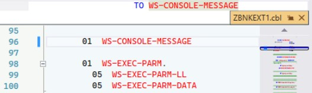

You can type in the window, or peek the definition of another data item in it.

**Finding all lines where a data item is used** 
1. Right-click a data item in the code, and click **Find All References**. This opens the Find Symbol Results window with a list of all occurrences of the data item in the code.
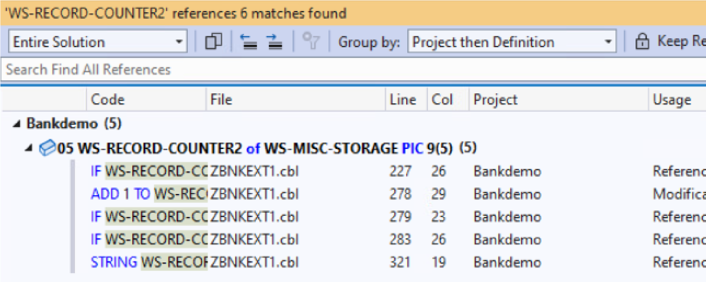

**Searching in copybooks**

You can search for strings in the copybooks as follows: 

1. Click **Edit \> Find and Replace \> Find in Files**. 

2. Set the **Look in** to **COBOL Project Copybook Paths**. 

3. Type BTX- in the search field.

   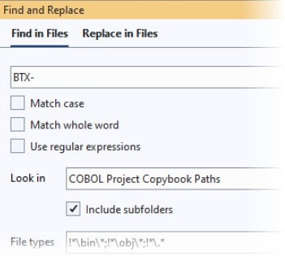

4. Click **Find All**. The results are displayed in the **Find "BTX-"** window.                                                                                                          

**Marking text and block mode**

You can use the mouse to mark the text. To make a block selection of the code:
- Press **Alt** and drag the selection with the mouse.                                                                               

**Rename items in the code**   
  Try and see how rename refactoring works in the IDE:

1. Click , **Go To Procedure Division**, in the COBOL toolbar to go to the Procedure Division in the **ZVBNKPRT1.cbl** file. 
2. Scroll down to line 228. 
3. Right-click WS-EXEC-PARM-LL, and click **Rename**. 
    
    This highlights all occurrences of the variable in the editor. The **Rename** widget opens. Note that any changes you make are applied to the current project by default. 

   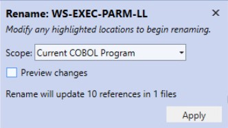

1.  Set **Scope** to **Current COBOL Program**, and check **Preview changes**.
2.  Start typing in the editor over the highlighted variable. For example, type WS-EXEC-PARM.
3.  Click **Apply**.

    This opens the **Preview Changes - Rename** dialog box showing which files and instances of the variable will be renamed. 

    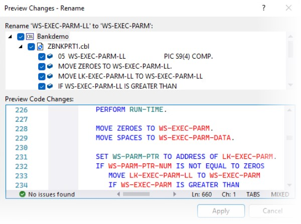

4.  Click **Apply** again.

    All instances of the data item are renamed in the current program.

5.  You can now click **Edit \> Undo** to revert the changes.

   **Smart editing** 
    
Let's look at how Smart Editing works with background COBOL parsing:

1.  Scroll down to line 259 in the ZBNKPRT1.cbl file and start typing the following, starting in area A of the COBOL editor, one character at a time:

        MOVE W TO

    Notice how the words you type change in the editor. Once a word is recognized as a reserved word or a data item, its color changes. If a line of code contains invalid COBOL syntax, the word that is not recognized is underlined with a wavy red line. You can check the **Error List** window to see what errors are reported.

2.  Change the line to:

        MOVE 34 TO WS-

3.  If you have changed this COBOL program, copy the backup version back in again.

**Renumbering the COBOL sources** 

You can choose from a number of **Renumber** and **Unnumber** options available from the COBOL toolbar (use  in the toolbar and the commands available from the dropdown menu) to insert and remove line numbers from your code. 

**Note:** If a COBOL source file includes some comments beyond column 73, you might want to change only the numbers in the COBOL sequence area as **Renumber** overwrites any text in the comments area. 

To insert the line numbers in your code:
1. Click the downward arrow next to  in the COBOL toolbar, and click **Renumber Left**.

   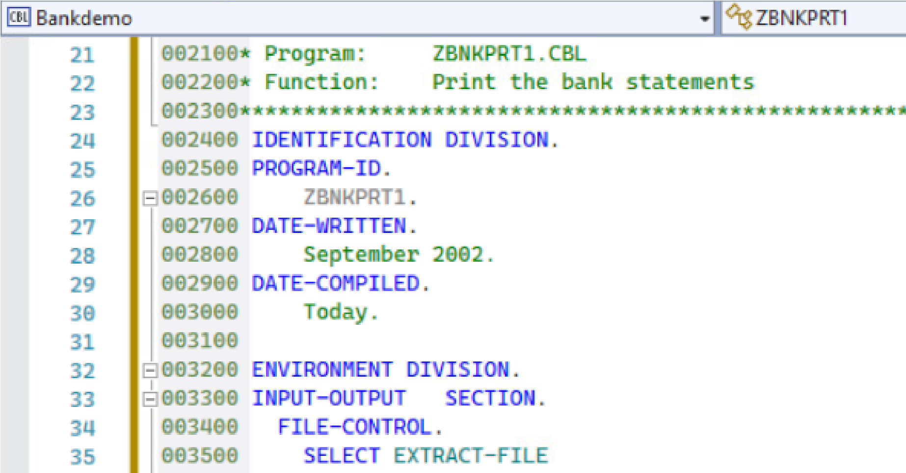

To insert line numbers beyond the end of area B:

1. Click the downward arrow next to  in the COBOL toolbar, and click **Renumber Both**.
You should now see line numbers running down both sides of the source code:
   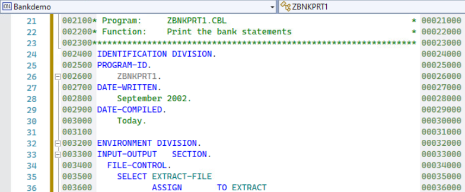

You can remove the line numbers from your code - note that the **Renumber** and **Unnumber** commands copybook view.

1. Ensure that **ZBNKPRT1.cbl** is opened in the editor, click the downward arrow next to  in the COBOL  toolbar, and click **Unnumber Left**. This removes the line numbers from the COBOL sequence area.

   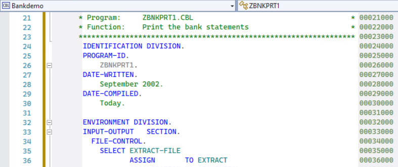

**JCL editing**

1. Double-click the **ZBNKSTMT.jcl** file in Solution Explorer to open it in the JCL editor.
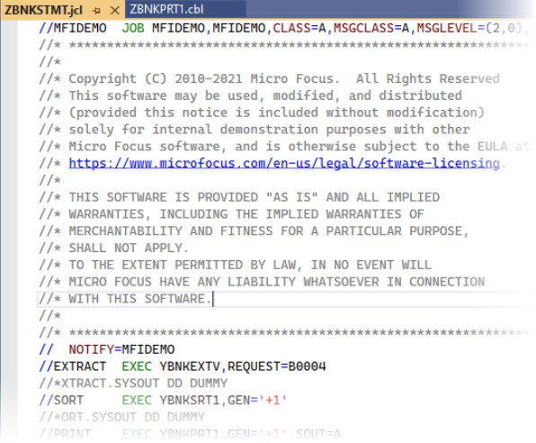

The editor enables you to edit JCL files in text view and offers a basic level of colorization for items such as reserved words and comments. The JCL editor does not support background parsing or syntax checking.

**BMS editing**

There are two ways to edit BMS files. The first one is to use the basic BMS text editor available in the IDE. The other is to use a WYSIWYG version, the Micro Focus BMS Painter, which is available as a separate utility installed with this product.

To open the BMS file in the IDE text view:

1. In Solution Explorer, double-click **MBANK10.bms** to open it in the basic BMS editor.
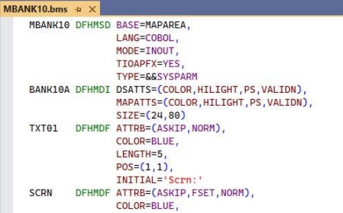

Although you can use this basic text editor to make small changes, it is quite difficult to edit BMS files in text view.

A much more suitable and less error-prone way to edit BMS files is to use the BMS Painter:

1.  Close the BMS text editor.
2.  In Solution Explorer, right-click **MBANK10.bms** in the **bms** folder, and click **Open BMS Painter**.

    This starts the external Micro Focus BMS Painter.
    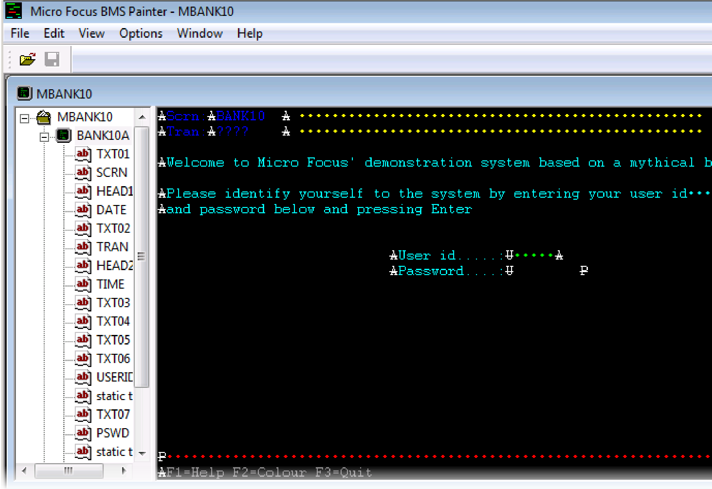

3.  In BMS Painter, you can click fields and move them by dragging.

    For example, double-click the data field immediately following the text “User Id” and move it to a different position on the map.

4.  To add a field, click in the desired place in the window and start typing.
5.  To change a field's properties, right-click it and select **Properties**.
6.  To change the properties of the map or mapset, right-click the item and select **Properties**.

    For example, do this for the MBANK10 mapset and the BANK10A map.

7.  Click **File** \> **Exit** to close the utility and do not save the file.

**Editing data files**

You can edit data files using one of two available Micro Focus Data File Editor tools.

By default, Visual Studio is configured to use the new Data File Tools utility. To check where this is enabled:

1.  Click **Tools \> Options \> Micro Focus Tools \> Data File Tools**.
2.  Ensure **Use New Data File Tools for supported options** is selected, and click **OK**.

    To edit the **.dat** file:

3.  In Solution Explorer, right-click the .dat file and click **Open with Data File Tools**.

    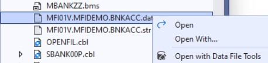

    This starts the **Data File Editor** and loads the **.dat** file in the **Open Data File** dialog box.

4.  Click **Open Exclusive** to load the file.

    The **Data File Editor** loads the data file and shows two views:
    -   The left-hand pane shows the raw form of the file. Because many of the field are COMP-3 fields, the data in these fields is presented in an ASCII view.
      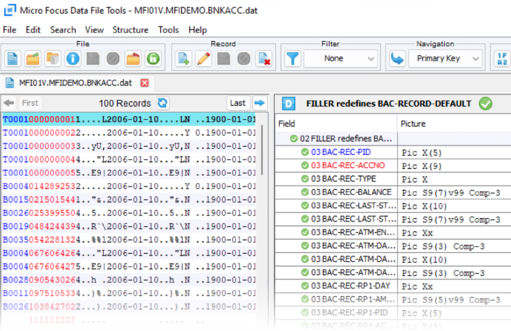
    - The right-hand pane shows the record layout for the file in its detailed field view and the COMP-3 fields are shown in a much better, editable form.
6.  Change the value of BAC-REC-BALANCE from 91.14 to 132.76 as follows: 

    a. Click the line for BAC-REC-BALANCE in the right pane and then click , **Edit Record**. This highlights the record.

    b.  Double-click in the **Value** field for BAC-REC-BALANCE.
    
    c.  Use the arrow keys to move the cursor inside the **Value** field.
    
    d. Type 132.76 then click , **Save Record**.

    e.  Confirm that you want to save the changes to this record.
    f.  Using the same method, restore the previous value of BAC-REC-BALANCE.
7.  Close the Data File Tools utility.

## Compiling the Source Code

[Back to Top](#overview)

**Important:** You need Enterprise Developer or Enterprise Developer for IBM zEnterprise to create executables. Building projects is not supported in Enterprise Developer Connect.

To compile the application:

1.  Click **Build** \> **Build Solution**.

    The Output window displays information about the progress of the build result

2.  If there are any problems, check the Error List window. Double-click on a line for an error number to position the cursor on it.

    The build checks for any files that have changed and does two things:

-   Compiles any files affected by the changes
-   Relinks the built files if necessary

**COBOL Compiler control**

The Micro Focus COBOL Compiler can compile many different COBOL dialect variations. It can also compile COBOL code that contains EXEC CICS or EXEC SQL statements. The Compiler is controlled through a series of "directives" which are passed to the Compiler at build time. You can set directives at either a project or component level.

Often the directives can be set only at the project level, which means that all component files in the project use them. Sometimes, you have a component which you need to compile with different directives. In this case, you can set the directives at the component level which overrides the project settings.

For example, most of the programs in your project could be using Enterprise COBOL for z/OS and only a few could use VS COBOL II. In this case, you would set directives for Enterprise COBOL for z/OS at the project level, and VS COBOL II at the respective COBOL programs.

The Bankdemo application already has the required Compiler directives set on the files. At build time, the IDE invokes the COBOL compiler to compile the sources and create a number of files. These "built" files can vary, but each COBOL program in the Bankdemo application compiles to produce the following three types of file:

| **File type**               | **Function**                                                                                |
|-----------------------------|---------------------------------------------------------------------------------------------|
| .dll - dynamic link library | Effectively the executable module the Compiler creates for each program.                    |
| .idy - debugger information | The file created by the Compiler which allows debugging of the module.                      |
| .obj - object file          | A temporary file the Compiler creates while producing the .dll. You can delete these files. |

**BMS Compiler control**

In the same way as for COBOL, the BMS compilation is controlled both at project and at component level.

The BMS Compiler produces the following two types of file:

| **File type**         | **Function**                                                                                  |
|-----------------------|-----------------------------------------------------------------------------------------------|
| .mod - BMS executable | A file created by the BMS compiler which is the executable module relating to the BMS source. |
| .cpy - copybook       | A copybook that contains the BMS mapping for use in a COBOL program.                          |

**Producing a Compiler listing**

You can configure the IDE to create a fully expanded Compiler listing file during the build. The following is also an example of setting a directive at component level:

1.  In Solution Explorer, right-click **ZBNKPRT1.cbl**, and click **Properties**.
2.  Click the **COBOL** tab.
3.  Set the **Generate listing file** field to **Yes**, and save your changes.
4.  Click **Build** \> **Build Solution**.

    During the build, the Compiler produces a source listing file, **ZBNKPRT1.lst**, in a Listing subfolder in

    the project directory (**C:\\MFETDUSER\\tutorial\\projects\\Studio\\cobol\\Bankdemo\\Listing** in this case). The listing file includes a fully expanded source file together with some Compiler system information at the start and with any Compiler errors highlighted with asterisks. From File Explorer, you can open the file in a text editor such as Microsoft's Notepad and view its contents.

**Example of compiling a COBOL program with errors**

You can introduce some Compiler errors into one of the programs to see how the Compiler handles them:

1.  In Solution Explorer, double-click **ZBNKPRT1.cbl**.
2.  Page down the program a few pages to the start of the Procedure Division around line 224.
3.  Introduce a few syntax errors as follows:
    - On line 226 change RUN-TIME to RUN-TME
    - On line 229 change SPACES to SPOCES
    - On line 237 place a period after the END-IF

     The errors are underlined with red wavy lines and a colored bar is added to the left of each line that includes an error.

4.  Hover over an underlined item to view a pop-up with an explanation of what the error is.
4.  Save the program, and build your solution.
6. Check the **Error List** window to view the list of errors.
7. Double-click an error in the list to position the cursor on the line of code that contains the error.
8. Check the errors in the listing file, **ZBNKPRT.lst** as follows:

    **a.** In File Explorer, navigate to **C:\\MFETDUSER\\tutorial\\projects\\Studio\\cobol\\Bankdemo\\Listing**, and open the file in a text editor.

    The lines that include syntax errors are marked with asterisks (\*\*).

    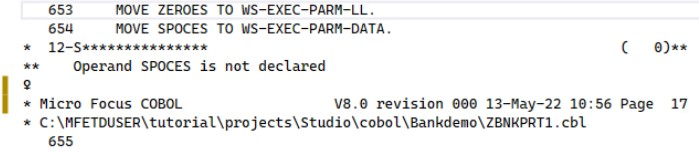

9. In the IDE, fix the errors in **ZBNKPRT.cbl**, save the file, and rebuild the solution.

    There should be no errors in the build now.

## Unit Testing the Batch Application

[Back to Top](#overview)

The first thing you need to do is check that the Bankdemo application is executing correctly.

To execute the JCL, you need to run the application in an instance of the Micro Focus Enterprise Server (sometimes abbreviated to Enterprise Server). This demonstration includes a pre-configured enterprise server instance called BANKDEMO which you need to import in Enterprise Server and start before you execute the Bankdemo application.

**Importing the Bankdemo server**

This sample provides a PowerShell script that creates the region definition to use in this tutorial:

1.  Open File Explorer, and navigate to the **C:\\MFETDUSER\\tutorial** folder.
2.  Right-click **createdefinition.ps1**, and click **Run with PowerShell**.
3. Type **A** when prompted for permissions in the PowerShell window.

    This executes the script and creates the Enterprise Server region definition file, **BANKDEMO.xml**, in the same folder. The file is configured for the location in which you have saved the sample files.

Ensure that the default settings are applied to the Directory Sever:

1.  Click the Start menu and open the Services application. Navigate to Micro Focus Directory Server to view its status and set it to **Running** if it is not already started.

2.  In Visual Studio, open the Server Explorer window.

    If the window is not visible, click **View** \> **Server Explorer** (or **View** \> **Other Windows** \> **Server Explorer**).

     **Tip:** Use the Auto Hide button () in the Server Explorer toolbar to pin the window to the IDE window.

3.  Right-click **Micro Focus Servers** and select **Directory Server Configuration**. This opens the Micro Focus Directory Server window. 

4.  Ensure that Host name is localhost and the Port number is 86.

To import the definition of the Bankdemo logical server (LSER) in Enterprise Server:

1.  In Visual Studio, open the Server Explorer window.

2.  Expand **Micro Focus Servers**.

    If you are presented with the **Enterprise Server Sign On** dialog box, click **OK**.

3.  Right-click **localhost**, and click **Import**.
4.  In the **Import Server** dialog box, click **...** on the line for **Import server definition file**.
5.  Browse to the **C:\\MFETDUSER\\tutorial** folder, select **BANKDEMO.xml**, and click **OK** twice.

6. Check the **Output** window for the results of importing the server. 
The Server Explorer window should now show a server called BANKDEMO under **Micro Focus Servers \> localhost**. If the server is not visible, right-click **Micro Focus Servers**, and click **Refresh**

**Associate the BANKDEMO Enterprise Server with your project**

Ensure your application is associated with the BANKDEMO server:

1.  Right-click the BANKDEMO server, and click **Associate With Project**.
2.  Ensure there is a check before the name of the Bankdemo application.

    

3. Click the **Bankdemo** project in Solution Explorer and see that the details of the associated server appear in the **Properties** window. The TN3270 port number will be populated once you start the server.

    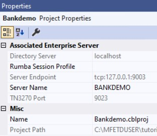

**Configure the IDE settings for Enterprise Server**

Configure the IDE to start the associated BANKDEMO server automatically as follows:

1.  Click **Tools \> Options**.
2.  Expand **Micro Focus Tools**, and click **Enterprise Server**.
3.  Check the following options on this page to enable the IDE to start or stop the associated server, and to enable dynamic debugging, for when it is not enabled in the server:
    - **Automatically start the associated server** - this ensures the IDE will start the server if it is not running when you execute the application.
    - **Stop running servers on project/folder close** - this enables the IDE to stop the server when you close the project.
    - **Automatically enable dynamic debugging** - this ensures the IDE will check whether the server has dynamic debugging enabled and, if it is not, will enable it when you start debugging.

4.  Click **OK**.

**Start the BANKDEMO Enterprise Server and Display the Server Log**

These are the steps to start the server manually, and are included for completeness. You do not have to start the server manually, as you have configured the IDE to start the server automatically. 

1. In Server Explorer, right-click **BANKDEMO** under **Micro Focus Servers**, then click **Start**.

    **Note:** You might receive an Enterprise Server Sign On dialog prompting you to provide connection details for the BANKDEMO server. This is a standard security dialog. Click **OK** without specifying any sign-on details. Also, you may skip enabling password recovery.

    You might receive a **Windows Security Alert** blocking the **MF Communications** process. Click **Allow access**.

2.  Right-click the BANKDEMO server in Server Explorer, and click **Show Console Log**.

    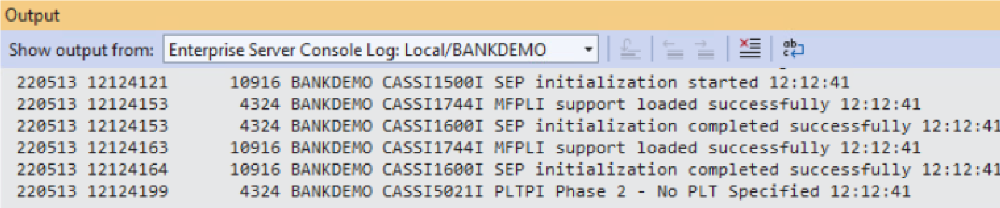
    See the **Output** window for the messages from the server log that show that the server has started.

3.  Right-click **Micro Focus Servers** again, and then click **Refresh** to see that the server has started.

    You are now ready to execute the JCL job.

**Executing JCL**

The JCL provided in your demo causes the COBOL application to read a file, sort the data and produce a report. The **.jcl** file, **ZBNKSTMT.jcl**, is in the **Bankdemo** project. To submit this job:

1.  In Solution Explorer, select the JCL file in the project, and then drag it across to Server Explorer, and drop it onto the BANKDEMO server.

    Alternatively, you can right-click the file in Solution Explorer, and select **Submit JCL**

    **Note:** If you have not started the BANKDEMO server yet, since you configured the IDE to start the server automatically, you receive a notification that the server will be started. Click **OK** to confirm this.

2.  Check the **Output** window to see that the job has been submitted and that the job has completed.

    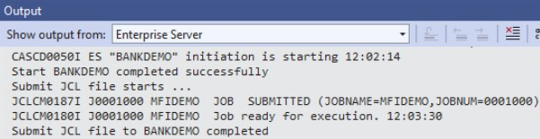

    Тhe job spool window automatically opens inside the IDE and shows the job details. You can also open this view from within Server Explorer.

    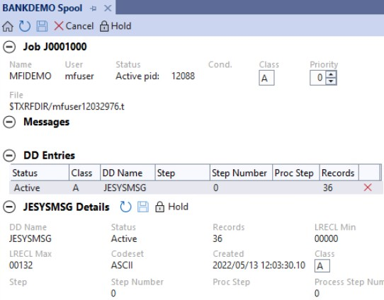

**Viewing the Catalog and the Spool**

You can open the catalog and the spool directly from Server Explorer.

To view the catalog:

1.  In Server Explorer, right-click the BANKDEMO server, and click **Show Catalog**.

    Alternatively, in Solution Explorer, right-click the BankDemo project, and click **Enterprise Server \> Show Catalog**.

    This opens the catalog:
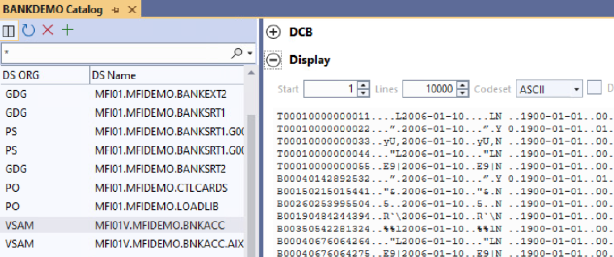

2.  Click a file name (for example, **MFI01V.MFIDEMO.BNKACC**) in the list in the left-hand pane. This displays the DCB information for this catalog item.
3.  Expand the **Display** section to preview the contents of the file.

To view the spool:

1.  In Server Explorer, right-click the BANKDEMO server, and click **Show Spool**.

    Alternatively, in Solution Explorer, right-click the Bankdemo project, and click **Enterprise Server \> Show Spool**. This might still show the details of the submitted JCL job.

5.  Close the tab for the job when you have reviewed the details.
6.  Click  (**Filter**) on the Home page of the Spool window to set some filters.
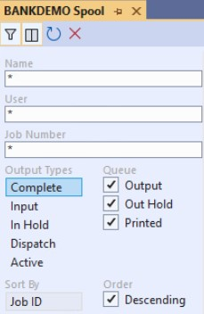
7.  Click the **Complete** button and also check **Descending** next to **Job ID** to see a list of all jobs in the completed queue, then click **Apply**. Your job is at the top of the list.
8.  Click the job you want to see in the list.

    This opens a page with a variety of information for the job progress, showing return condition code (**Cond.**) of 0000:

    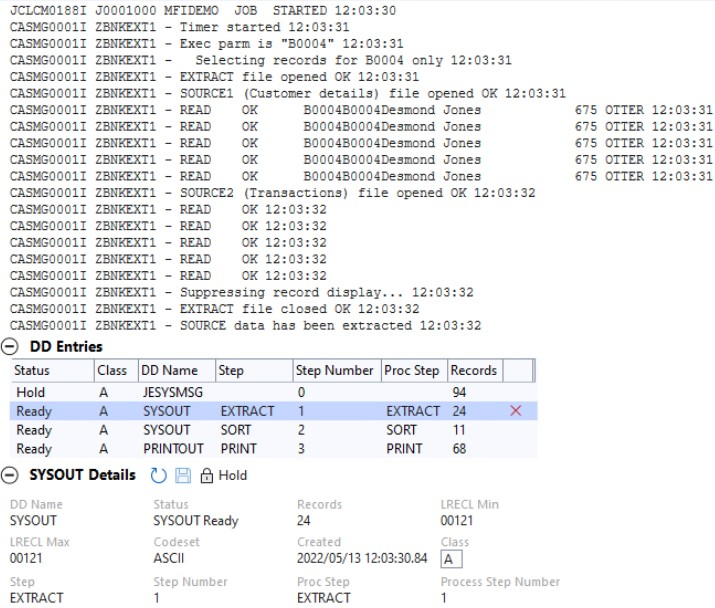

    In the **DD Entries** section, there are:
    -   Two **SYSOUT** results (one for the EXTRACT and one for the SORT). Click these and see the **SYSOUT Details** section:
        Again, if you cannot see your SYSOUT files, make sure you have selected **Printed** in the filter.
    -   The **PRINTOUT** is the final printed results created by your job. Click **PRINTOUT** in the **DD Entries** section to see the results:

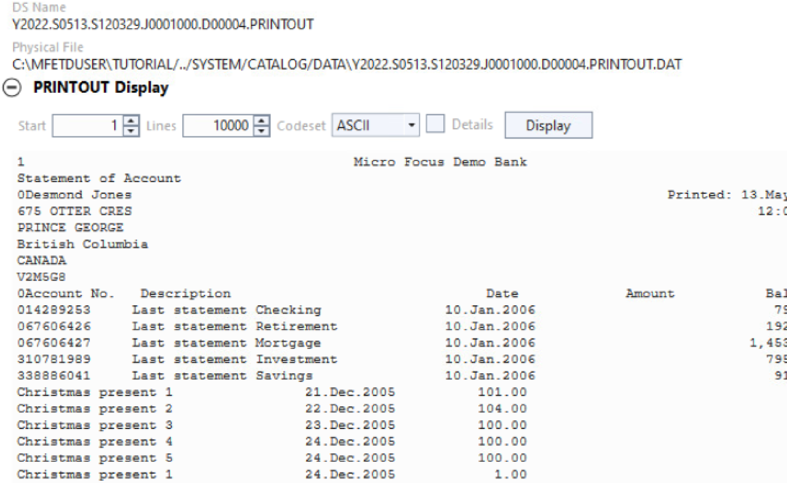
    You can now start to look at how to run the online application.

## Unit Testing the Online Application

[Back to Top](#overview)

In the previous step, Unit Testing the Batch Application, you used the BANKDEMO enterprise server. You are going to use it again for online testing.

As with JCL, execution of the jobs requires a previously configured Micro Focus enterprise server.

Before you proceed, ensure that Micro Focus Host Access for the Cloud (HACloud) is running:

1. Go the the Start menu and open the Services application.

2. Navigate to the Micro Focus HA Cloud service and check that its status is set to **Running**.

3. If it is not running, right-click and click **Start**.

**Executing the CICS application**

The CICS application requires that you use a 3270 terminal emulator. This tutorial uses Micro Focus Host Access for the Cloud (HACloud), but you may adapt the tutorial to suit your terminal emulator of choice. 

**Configuring the TN3270 settings in the IDE** 

To check the IDE preferences for a TN3270 display:

1.  In the IDE, click **Tools \> Options**.
2.  Expand **Micro Focus Tools**, and click **TN3270 Display**.
3.  Ensure that **Host Access for the Cloud** is selected.
4.  Click **OK**.

**Starting the terminal emulator**

1. Right-click the BANKDEMO server in Server Explorer, and click **Mainframe TN3270 Display**.

This opens the **Host Access for the Cloud** in your default browser and automatically establishes a 3270 terminal connection to the BANKDEMO server. You can see the starting page of the ES/MTO region BANKDEMO.

**Executing the Enterprise Server Demonstration**

1.  Type your logon details, and press **Enter**.
A suitable **User Id** is b0001. You can type anything as a **Password** - the field must not be empty though.

    

2.  Type **/** against **Display your account balances**, and press **Enter** to see the details for this customer.

    

    

3.  You can explore this application further if you wish or press **Ctrl + F2** to clear the screen and conclude the session.

**Stopping the enterprise server**

You can stop the Bankdemo server from within Server Explorer. You can leave it running though, if you wish to continue this tutorial.

**Note:** In production, enterprise servers are long-running processes that are usually run for many months without stopping and starting.

## Debugging the Batch Application

[Back to Top](#overview)

You are going to debug the batch Bankdemo application using the JCL debugger.

**Starting the Bankdemo enterprise server**

If the enterprise server is not yet started, you need to start it as follows:

1.  In Server Explorer, right-click **BANKDEMO** under **Micro Focus Servers**, then click **Start**.
2.  Right-click **Micro Focus Servers** again, and then click **Refresh** to see that the server has started.

    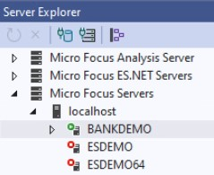

**Starting the debugger**

The demonstration application includes around 60 programs and some of them are debuggable. The default debugger in Enterprise Developer is the CICS Debugger. You need to select the JCL debugger to debug the batch Bankdemo application:

1.  In Solution Explorer, right-click the **BankDemo** project and click **Properties**.
4.  Click the **Debug** tab in the properties.
5.  Set **Launch** to **JCL**.
6.  Click **File** \> **Save All** to save your changes.

To start the debugger:

- Click **Debug** \> **Step Into**.

    Visual Studio enters debug mode and opens a few new windows.

    The application is now waiting for an event that will trigger the debugging.

**Simple debugging**

You can now look at some simple features inside the debugger. To submit the JCL job:

1.  In Solution Explorer, right-click **ZBNKSTMT.jcl**, and click **Submit JCL**.

    The debugger starts, and the IDE opens **ZBNKEXT1.cbl** for debugging, with the execution point set on the first line of Procedure Division.

    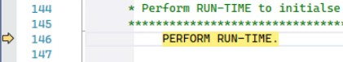

2.  Check the Output window (click **View \> Output** to show the window, if it is hidden) and set **Show output from** to **Enterprise Server** to verify that the job has been submitted successfully.
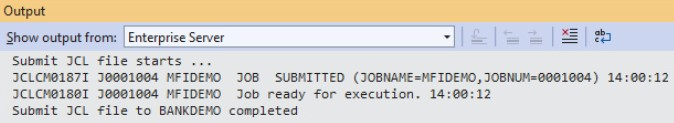

**Stepping through the code**

The highlighted line of code is the one the IDE will execute next.

1.  Press **F11** (Step Into) to execute the highlighted line.

    The PERFORM statement executes and takes you to the line starting with IF TIMER-START.

2.  Press **F11** slowly a few more times until you reach line 160.

**Using Run To Cursor**

1.  Scroll down the file and position the cursor on a line further down the code.
2.  Right-click the line in the editor, and click **Run To Cursor**.

    The application runs and executes the instructions till the line you selected.

**Using the debug windows**

There are a number of default windows which you can use while debugging the application such as:

**Autos** 

Shows the values of the data items on the current line you have stepped into:

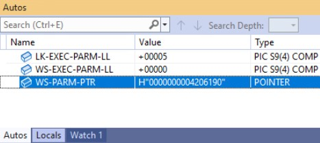

**Watch** 

This window shows the values of data items you have added to the watch list. To set a watch on a data item:

1.  Scroll up to line 67 in **ZBNKEXT1.cbl**.
2.  Right-click WS-RECORD-COUNTER1 and click **Add Watch**.

    This adds the item to the Watch window so you can see how it changes as you step through the code.

    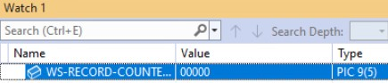

There are some additional windows you can use as well. To open them:

1.  Click **Debug** \> **Windows** and select a window from the list.
3.  Open the windows for Breakpoints, Watchpoints, Program Breakpoints, a number of one to four Memory windows:

    

    Note that the windows are stacked, with a tab running along the bottom of the window.

**Looking at data values in debug mode**

While debugging, you can preview the values of data items in the current context as follows:

1.  Open the **ZBNKEXT1.cbl** file and scroll down the code to line 227.
2.  Hover over the WS-RECORD-COUNTER2 data item.

    This opens a pop-up with the value of the item in the current context:

    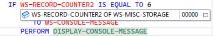

3. You can click  to pin the pop-up to the editor window. 

**Setting a simple breakpoint**

Open the Breakpoints window - currently, there are no breakpoints set in the program. You can set a simple breakpoint as follows:

1.  Scroll up the code to line 171 of the **ZBNKEXT1.cbl** file.
2.  Double-click in the grey area to the left of this line or right-click the line, and click **Breakpoint** \> **Insert Breakpoint**.

    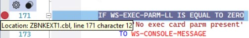

3.  Do the same for line 177.

    **Note:** You can enable and disable the breakpoints from the Breakpoints window.

    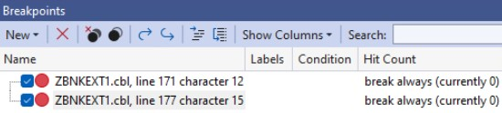

4.  Click **F5** to run the code.

    The execution of the code stops at the first breakpoint.

5.  Press **F5** to resume the execution.

    You can see that **ZBNKEXT1.cbl** finishes and the debugger starts to debug the second program defined in the JCL.

**Setting a COBOL watchpoint**

COBOL watchpoints enable you to watch the memory associated with data items. You can add a COBOL watchpoint as follows:

1.  Scroll to line 99 in the code of **ZBNKEXT1.cbl** file.
2.  Right-click WS-EXEC-PARM-LL, and click **Add COBOL Watchpoint**.

    This adds the item to the COBOL Watchpoints window.

3.  Notice how the value of this data item changes as you step through the code.

    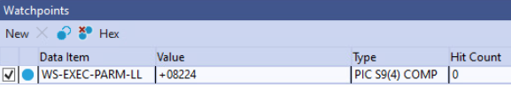

**Note**: To view watchpoints, you need to restart debugging as previously shown. 

**Running CSI queries**

You can use the COBOL Source Information (CSI) functionality and its **Quick Browse** dialog to obtain information about your program when you are debugging it.

1.  Open the **SBANK00P.cbl** file in the editor.
2.  Click , **Quick Browse**, in the COBOL toolbar to start the CSI query control.

    See *COBOL toolbar* in the product help for more information.

3.  Enter a simple query such as WS-\*.

    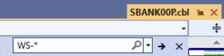

4.  Press **Enter** to run the query.

    The results are shown in the **Micro Focus Code Analysis** window:
    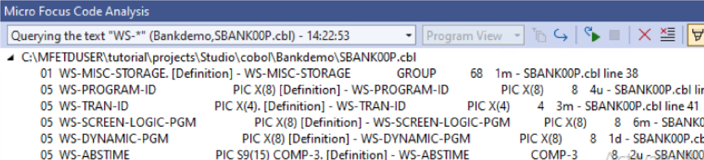

**Running COBOL reports**

   Enterprise Developer provides a few COBOL reports which you can run against your COBOL programs to help you understand and optimize them. For example, to run a report to identify any code that cannot be reached or executed, you need to run an unreferenced data report:
1.  With the **SBANK00P.cbl** file still opened in the editor, click the down arrow next to , **Quick Browse**, in the COBOL toolbar, and click **Unreferenced Data**.

      The IDE shows the results in the **Micro Focus Code Analysis** window:
    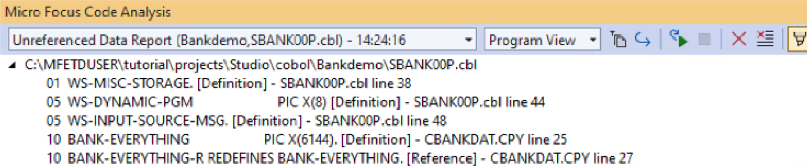

    2.  Expand any of the lines in the report and double-click a line in the result to highlight the lines of code that include unreferenced data.
    3.  Use the rest of the commands available from the down arrow next to , **Quick Browse**, in the COBOL toolbar to run any of the other available reports.

**Stop debugging**

 Although the job has completed, the debugger is still waiting for the next event. To stop debugging:

   - Click **Debug** \> **Stop Debugging**.

## Debugging the Online Application

[Back to Top](#overview)

**Starting the BANKDEMO enterprise server**

If the enterprise server is not yet stated, you need to start it as follows:

1.  In the IDE, open the Server Explorer window.

    If the window is not visible, click **View** \> **Server Explorer** (or **View** \> **Other Windows** \> **Server Explorer**).

2.  In Server Explorer, right-click the BANKDEMO server, and then click **Start**.

    Wait until the server has started. In the list of servers in Server Explorer, BANKDEMO still has a red square next to it. This is a refresh delay.

3.  In Server Explorer window, right-click **Micro Focus Servers**, and click **Refresh** to confirm the server has started.

**Starting the debugger**

The demonstration application includes around 60 programs and some of them are debuggable. The default debugger in Enterprise Developer is the CICS debugger. You are going to use this to debug the online Bankdemo application:

1.  In Solution Explorer, right-click the **Bankdemo** project, and click **Properties**.
2.  Click the **Debug** tab in the properties.
3.  Set **Launch** to **CICS**.
4.  Type **BANK** in the **Transaction** field.
5.  Click **File** \> **Save All** to save your changes.

To start the debugger:

1.  Click **Debug** \> **Step Into**.

    Visual Studio enters debug mode and a few new windows open in the IDE. HACloud starts outside of Visual Studio but does not show the sign-on application screen yet.

    The program SBANK00P starts to execute and execution stops on the first EXEC CICS statement in the code.

    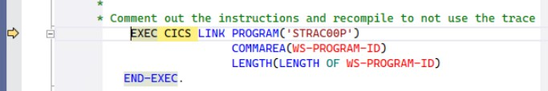

2.  Continue stepping through the code.

**Simple debugging**

You use the same features as previously to debug the application.

1.  Click **Debug** \> **Step Into** or press **F11** a few times to go through executing the code.
2.  Watch how the values of the variables change in the **Autos** window.

**Stop debugging**

Although the job has completed, the debugger is still waiting for the next event. To stop debugging:

**1.** Click **Debug** \> **Stop Debugging**.

This concludes this set of tutorials that introduce Micro Focus Enterprise Developer.

[Back to Top](#overview)
